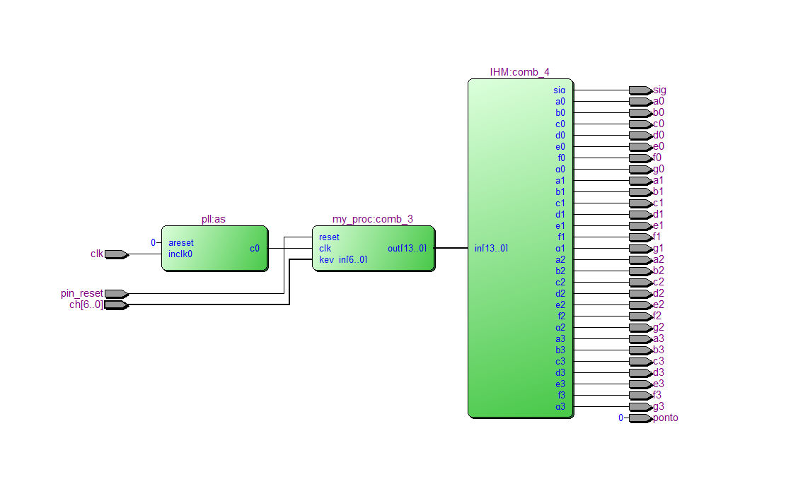
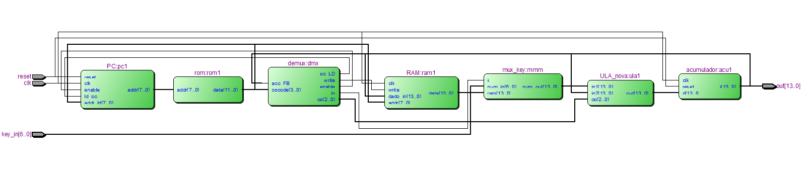
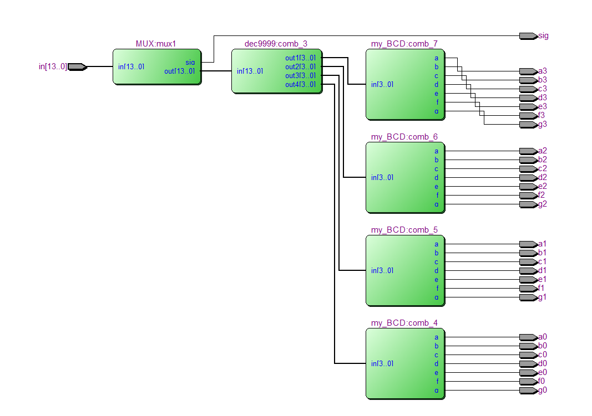

# Soft processor using Altera EP2C70F896DE70.

### Basic Verilog RISC processor design.  
<figure>
    
    <figcaption>Circuit overview.</figcaption>
</figure>

### The required board is a DE70 or any other with at least two 7-segments display and switches.
<figure>
    
    <figcaption> Above the CPU, with symbols: ld_PC(program counter load), acc_FB(accumulator feedback), op(operator), d/q (flip flop I/O) </figcaption>
</figure>

### The ROM example code implements an user input fatorial calculation.
<figure>
    
    <figcaption>IHM blocks.</figcaption>
</figure>

